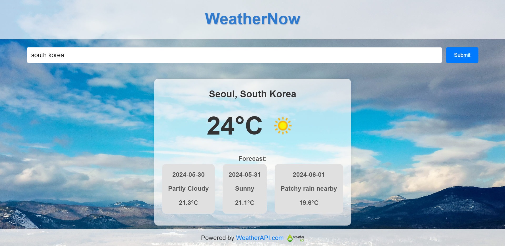

# WeatherNow




## Introduction

Weather App is a simple and intuitive web application that allows users to get current weather information for any location. The app fetches data from the WeatherAPI and displays the current weather along with a 3-day forecast.

## Features

- Fetches and displays current weather information.
- Provides a 3-day weather forecast.
- Displays weather icons and conditions.
- Handles invalid location entries gracefully.
- Responsive design for different screen sizes.

## Demo

You can check out a live demo of the application [here](https://rushil-weathernow.netlify.app/).

## Technologies Used

- HTML
- CSS
- JavaScript
- [WeatherAPI](https://www.weatherapi.com/)

## Getting Started

### Prerequisites

Before you begin, ensure you have the following installed on your system:

- [Node.js](https://nodejs.org/en/) (v12 or later)
- [npm](https://www.npmjs.com/) (v6 or later) or [Yarn](https://yarnpkg.com/)

### Steps

1. **Clone the Repository**

    ```sh
    git clone https://github.com/RushilJalal/WeatherNow.git
    cd WeatherNow
    ```

2. **Install Dependencies**

    If you're using npm:

    ```sh
    npm install
    ```

    Or if you're using Yarn:

    ```sh
    yarn install
    ```

3. **Run the Development Server**

    If you're using npm:

    ```sh
    npm run dev
    ```

    Or if you're using Yarn:

    ```sh
    yarn dev
    ```

4. **Open in Browser**

    Open your browser and navigate to `http://localhost:3000` to see the application in action.


## Usage

1. Open the application in your web browser.
2. Enter a location in the search box.
3. Press the "Search" button or hit the Enter key to fetch and display the weather information.
4. If the location is invalid, an error message will be displayed.
